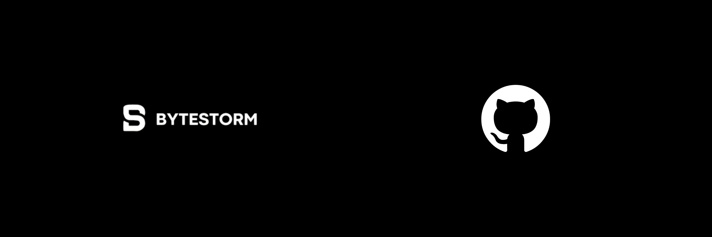

<h1 align="center">ByteStorm™</h1>

 
Somos una empresa innovadora dedicada al diseño y desarrollo de <i>soluciones digitales</i>, incluyendo aplicaciones web, software multiplataforma y herramientas adaptadas a una amplia gama de sistemas operativos, como <strong>Windows, macOS, Linux, iOS y Android.</strong>

## 🦄 ¿Qué es esto?

> Esto es un equipo de GitHub, creado con el propósito de desarrollar y gestionar diversos códigos que serán fundamentales en nuestros proyectos. A través de esta plataforma, podremos organizar, visualizar y colaborar en cada implementación de manera eficiente, asegurando que todos los integrantes del equipo tengan acceso a los avances y contribuciones realizadas.

## 💼 ¿Qué tecnologías utilizamos?

En nuestros proyectos, utilizamos una variedad de lenguajes y herramientas para garantizar soluciones eficientes y de alto rendimiento. Estos son algunos de los principales:

### 🌐 Desarrollo Web  
- **PHP & MySQL** → Para la gestión de bases de datos y desarrollo backend.  
- **HTML & CSS** → Creación de interfaces web atractivas y responsivas.  
- **JavaScript** → Desarrollo de funcionalidades dinámicas e interactivas en nuestras aplicaciones.  

### 💻 Desarrollo de Software  
- **C++ & C#** → Utilizados en aplicaciones de alto rendimiento y desarrollo de software.  
- **Swift** → Para la creación de aplicaciones en el ecosistema de **Apple**.  
- **Rust** → Para proyectos que requieren seguridad, eficiencia y alto rendimiento.  
- **Bash** → Para la automatización de procesos en entornos **Unix/Linux**.  

📌 **Nuestros desarrollos están disponibles en [Byte Storm](https://byte-storm.xyz), donde innovamos constantemente con nuevas tecnologías.**  

  
  

Todo esto fue hecho por katsito. :shipit: